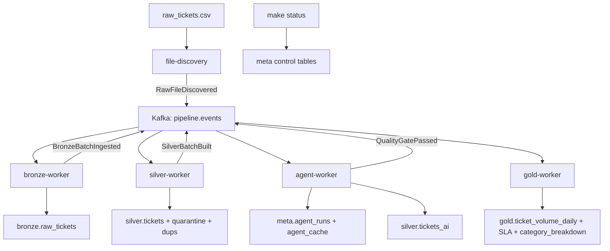

# AI-Assisted Medallion Pipeline

Local event-driven medallion pipeline for messy support-ticket data. The implementation keeps the take-home scope lean: Docker Compose, PostgreSQL, Kafka/KRaft, Python workers, Pydantic JSON events, and LangGraph only inside the agent worker.

## How To Run

```bash
make up
make db-init
make run
make status
```

Optional:

```bash
make eval
make run-drift
make proposals
make approve ID=<proposal_id>
make reject ID=<proposal_id>
```

The pipeline runs without `OPENAI_API_KEY`. In that mode, semantic classification falls back to deterministic heuristics and still writes auditable agent/cache metadata.

## Architecture



Kafka carries batch/stage events, not row events. Postgres is the durable source of truth for Bronze, Silver, Gold, and metadata.

## Event Contracts

Topics:

- `pipeline.events`: normal stage events and commands.
- `pipeline.retry`: reserved for transient retry events.
- `pipeline.dlq`: poison events with original payload and error metadata.

Every event includes:

- `event_id`
- `event_type`
- `event_version`
- `run_id`
- `batch_id`
- `correlation_id`
- `idempotency_key`
- `attempt`
- `occurred_at`
- `payload`

Consumers use at-least-once delivery and idempotent writes. A consumer records `meta.processed_events` only after its DB work succeeds.

## Medallion Layers

### Bronze

`bronze.raw_tickets` stores every physical CSV row with:

- All source columns as text.
- `source_file`, `raw_line_no`, `batch_id`, `ingested_at`.
- `content_hash` as a change fingerprint.
- Full `raw_payload` JSONB and `extra_fields` JSONB.

Bronze does not clean, normalize, or drop records. The identity is `(source_file, raw_line_no)` so reruns do not duplicate physical rows.

Schema drift is captured automatically. When a new CSV column appears, Bronze stores it in `raw_payload` and `extra_fields`, and `meta.source_schemas` records added, removed, and common columns for the batch.

### Silver

`silver.tickets` contains typed, cleaned, deduplicated records. Field-level anomalies are kept as JSON flags. Structurally unusable rows go to `silver.tickets_quarantine`; duplicate losers go to `silver.tickets_dups`.

Cleaning rules:

- Dates use a documented US `MM/DD` policy. Ambiguous and invalid dates are flagged.
- `resolved_at < created_at` is flagged and excluded from SLA metrics.
- Costs strip `$` and map `-1`, negatives, `N/A`, and `TBD` to NULL plus flags.
- SLA values `0`, `999`, invalid, and missing values are excluded from Gold SLA metrics.
- Dedup uses valid `ticket_id` first, then a deterministic fallback fingerprint.

### Gold

Gold products are deterministic:

- `gold.ticket_volume_daily`: ticket volume by day, status, priority, category, and assigned team.
- `gold.resolution_sla_summary`: SLA met rate, breach count, median/p95 resolution hours, and exclusions.
- `gold.category_breakdown`: canonical category distribution from deterministic and AI enrichment.

## Schema Drift Promotion

New source columns are not promoted silently. The pipeline uses a governed human-in-the-loop flow:

1. Bronze ingests the new column into `raw_payload` and `extra_fields`.
2. `meta.source_schemas` records drift details, including `added_columns`.
3. The Data Quality Agent samples the new field and creates a `schema_mapping` proposal.
4. A human reviews the proposal with `make proposals`.
5. Approval adds a real nullable column to `silver.tickets` and records the mapping in `meta.schema_mappings`.
6. The next Silver rebuild populates the approved column from Bronze.
7. If the field looks useful for reporting, the agent creates a separate `gold_impact` proposal. Gold tables are not changed automatically because they are reporting contracts.

Demo with the included drift fixture:

```bash
make clean
make up
make db-init
make run
make run-drift
make proposals
make approve ID=<schema_mapping_proposal_id>
make run-drift
```

After approval, inspect the promoted Silver column:

```bash
docker compose run --rm app python - <<'PY'
from src.db import fetch_all

rows = fetch_all(
    "SELECT ticket_id, customer_tier FROM silver.tickets WHERE customer_tier IS NOT NULL ORDER BY ticket_id"
)
for row in rows:
    print(row)
PY
```

Use `make proposals` again to review any `gold_impact` proposal. Approving a Gold impact proposal records the decision, but changing Gold tables still requires deterministic code changes.

## Agent Assessment

### Data Quality Agent

Input: run counts, quarantine rate, schema drift metadata, and quality results.

Output: auditable rule proposals in `meta.agent_runs`, schema-mapping proposals for new Bronze columns, and high-risk proposals in `meta.agent_proposals`.

Assessment: useful for explaining why a rule matters and when a human should review a drift or quarantine spike. Deterministic code still applies the actual rules.

### Semantic Classification Agent

Input: distinct dirty category/text values from Silver.

Output: canonical category, confidence, method, model, prompt version, token/cost metadata, and cache status in `silver.tickets_ai`.

Assessment: useful for unknown or ambiguous operational labels. The pipeline avoids per-row LLM calls by caching distinct normalized inputs and using dictionary/regex rules first.

## Observability And SLA

Local observability is metadata-first:

- `meta.pipeline_runs`: end-to-end run status and counts.
- `meta.stage_runs`: stage status, row counts, duration, late flag, and errors.
- `meta.quality_results`: reconciliation, parse, SLA exclusion, and Gold-readiness checks.
- `meta.outbox_events`, `meta.processed_events`, `meta.dlq_events`: event delivery and failure evidence.
- `meta.agent_runs`, `meta.agent_cache`: model, prompt version, confidence, cost, tokens, and cache behavior.

`make status` summarizes the latest run health, stage durations, quality failures, DLQ count, agent cost/cache stats, pending proposals, and Gold readiness.

Business SLA is measured only from clean Silver inputs. Pipeline SLA is represented by stage/run duration and late-stage flags.

## Logging And Status

Runtime logs go to stdout/stderr so they appear in the terminal during `make run` and in Docker logs for worker containers. Logs use concise key-value messages and avoid secrets, raw payload JSON, full ticket descriptions, and prompt text.

Use runtime logs while the pipeline is running:

```bash
make run
```

Use the durable status view after a run:

```bash
make status
```

Use Docker logs for long-running worker services:

```bash
make logs
```

The logs show stage starts/completions, row counts, reconciliation results, schema drift details, agent mode, cache hits/misses, token/cost usage, event publish/outbox behavior, DLQ writes, and Gold product counts. `make status` remains the authoritative summary backed by the `meta.*` tables.

## Failure Handling

- Duplicate event: skipped by `meta.processed_events`.
- Consumer crash before offset commit: Kafka redelivers; database constraints keep writes idempotent.
- DB commit succeeds but Kafka publish fails: `meta.outbox_events` preserves the event for republish.
- Poison event: recorded in `meta.dlq_events`.
- Invalid agent output: recorded as agent failure and never mutates Silver or Gold.
- Quality gate failure: Gold does not build.

## What Changes At 100x Scale

- Move Bronze/Silver from Postgres to Delta Lake or Iceberg on object storage.
- Keep Postgres as the control plane for run state, approvals, idempotency, costs, and agent metadata.
- Add Schema Registry for event contracts.
- Use Debezium CDC for the outbox relay.
- Partition Kafka topics by tenant/source/domain.
- Use Spark, Flink, Dagster, dbt, or managed lakehouse pipelines for transforms.
- Add OpenTelemetry, Prometheus/Grafana, centralized logs, and alerting.
- Add a catalog/lineage system such as Unity Catalog, DataHub, Atlan, or OpenLineage.
- Use batch/asynchronous LLM enrichment with tenant budgets and stronger eval gates.

## Why No FastAPI

The local assignment does not need an API server. Workers, Kafka, Postgres, and CLI commands cover the required pipeline, observability, and HITL approval flow. FastAPI would be a reasonable production addition for status, approvals, replay, or data-product APIs.
