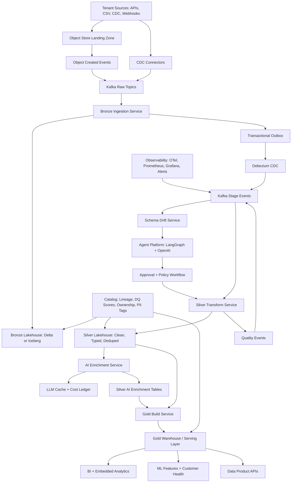

# Enterprise B2B SaaS Medallion AI Pipeline — At-Scale Plan

This is a separate scale plan. It is not the 6-hour take-home implementation plan. It describes how the same product would evolve for an enterprise B2B SaaS company with many tenants, daily incremental loads, compliance needs, and downstream analytics/ML consumers.

## Goals

- Ingest tenant operational data continuously or in micro-batches.
- Preserve raw data exactly for audit/replay.
- Progressively refine data through Bronze, Silver, and Gold.
- Support schema drift safely across tenants and source versions.
- Use AI agents to accelerate schema mapping, data-quality rules, semantic classification, and Gold model design.
- Keep LLM outputs auditable, cached, versioned, and reversible.
- Provide strong observability, lineage, SLA tracking, and tenant-level governance.
- Scale from 1M rows/day to tens or hundreds of millions without redesigning core contracts.

## High-Level Architecture



## Core Platform Choices

### Storage

- **Bronze/Silver:** Delta Lake or Apache Iceberg on object storage.
- **Gold:** warehouse/serving layer such as Databricks SQL, Snowflake, BigQuery, ClickHouse, or Postgres only for small customer-specific marts.
- **Control plane:** Postgres for pipeline state, approvals, agent runs, idempotency keys, lineage metadata, and cost ledger.
- **Do not use Postgres as the main analytical store** once data reaches 1M+ rows/day with broad scans.

### Messaging

- Kafka, Confluent Cloud, MSK, Event Hubs, or Redpanda.
- Topics partitioned by tenant and source domain.
- Use at-least-once delivery plus idempotent consumers.
- Use Schema Registry for event contracts and compatibility checks.
- Use DLQ and retry topics with backoff.

### Processing

- Bronze ingestion: Kafka Connect, Flink, Spark Structured Streaming, or custom ingestion services.
- Silver transforms: Spark, Flink, dbt, Dagster, or managed lakehouse pipelines.
- Gold builds: dbt/SQL models, materialized views, incremental table builds.
- Agent workflows: LangGraph for iterative proposals, reviews, and HITL checkpoints, not for bulk row processing.

### AI

- OpenAI Structured Outputs or equivalent typed-output model.
- Batch API for non-urgent high-volume enrichment.
- Synchronous calls only for small rule/proposal generation.
- Cache every LLM result with a stable key.
- Keep AI output separate from source truth.

## Multi-Tenant Data Model

Every table and event must carry:

- `tenant_id`
- `source_system`
- `source_object`
- `schema_version`
- `batch_id`
- `event_id`
- `ingested_at`
- `data_residency_region`

Tenant isolation options:

- **Small/mid scale:** shared tables with `tenant_id`, row-level security, and strict partitioning.
- **Large/regulated tenants:** separate catalog/schema/bucket per tenant or tenant group.
- **Enterprise exports:** dedicated Gold marts with contractual SLA and access policies.

## Event Contract

Use Schema Registry in production.

```json
{
  "event_id": "uuid",
  "event_type": "SilverBatchReady",
  "event_version": "v3",
  "tenant_id": "tenant_123",
  "source_system": "zendesk",
  "source_object": "tickets",
  "schema_version": "tickets_v12",
  "batch_id": "tenant_123_zendesk_tickets_2026_06_20_00",
  "correlation_id": "uuid",
  "idempotency_key": "silver:tenant_123:zendesk:tickets:2026_06_20_00:v3",
  "occurred_at": "2026-06-20T00:00:00Z",
  "payload": {
    "bronze_table": "tenant_ops.bronze.zendesk_tickets",
    "silver_table": "tenant_ops.silver.tickets",
    "partition": "ingest_date=2026-06-20",
    "row_count": 154239,
    "quarantine_count": 87,
    "data_quality_score": 0.982
  }
}
```

## Topic Strategy

Start with domain-stage topics:

- `raw.file.discovered`
- `raw.cdc.events`
- `bronze.batch.ingested`
- `schema.drift.detected`
- `silver.batch.requested`
- `silver.batch.ready`
- `ai.enrichment.requested`
- `ai.enrichment.completed`
- `quality.gate.failed`
- `gold.build.requested`
- `gold.product.ready`
- `pipeline.dlq`

Partition keys:

- `tenant_id` for tenant-ordered processing.
- `tenant_id:source_object` when source ordering matters.
- `batch_id` for batch-stage processing.

Avoid row-level stage events unless the product requires low-latency operational actions. For analytics pipelines, batch/partition events scale better.

## Medallion Layers

### Bronze

Purpose: immutable source-of-truth and replay layer.

Practices:

- Store raw payload as received.
- Partition by tenant, source, ingest date.
- Capture source metadata, file/object metadata, CDC metadata.
- Store full schema snapshot per batch.
- Do not clean, drop, or interpret business meaning.
- Enforce only physical ingest validity: readable payload, parseable envelope, required metadata.

### Silver

Purpose: trusted record-level data.

Practices:

- Type and normalize fields.
- Deduplicate by source-aware business keys.
- Resolve late-arriving records and CDC updates.
- Quarantine structural failures.
- Flag field-level anomalies.
- Keep one non-aggregated cleaned record representation.
- Add PII tags and normalized semantic fields.
- Support replay by partition and by source high-watermark.

### Gold

Purpose: data products for analytics, APIs, ML, and customer-facing dashboards.

Practices:

- Build product-specific facts/dimensions.
- Precompute metrics used by customers and internal teams.
- Enforce row-level/tenant-level access.
- Publish data contracts and freshness SLAs.
- Expose data-quality scores and lineage.
- Optimize storage/layout for query latency.

## Schema Drift and Evolution

Enterprise schema drift workflow:

```text
new payload/header/schema
  -> Bronze stores safely
  -> Drift service compares against schema registry/catalog
  -> SchemaDriftDetected event
  -> Agent proposes mapping/migration/rule update
  -> Automated policy checks risk
  -> Human approval for high-risk changes
  -> Versioned transform deployed
  -> Silver rebuilds affected partitions
```

Drift categories:

- Additive nullable column: auto-accept to Bronze, propose Silver mapping.
- Additive non-null column: require owner review.
- Missing column: flag, fill NULL only if contract permits.
- Rename: agent can suggest, human must approve.
- Type change: preserve raw, create parse-failure metrics, require versioned transform.
- Semantic drift: detect via distribution/category shifts; agent proposes taxonomy/rule updates.

## Agent Architecture

Agents operate on metadata, profiles, samples, and proposals. They do not directly mutate core tables.

Agents:

- **Schema Evolution Agent:** proposes mappings, migrations, and compatibility impact.
- **Data Quality Agent:** proposes validation rules, quarantine rules, and alert thresholds.
- **Semantic Classification Agent:** proposes/maintains canonical taxonomies and labels.
- **Gold Design Agent:** proposes facts, dimensions, and data products.
- **Lineage/Impact Agent:** explains downstream blast radius of schema/rule changes.

Agent-native requirements:

- Tools are primitives: read profile, read schema, list batches, write proposal, update proposal, approve/reject, record eval, record cost.
- Prompt context includes tenant, source, schema history, profiles, current rules, rejected proposals, SLA, and cost budget.
- Every proposal is stored with model, prompt version, input hash, output JSON, rationale, risk, confidence, cost, status.
- High-risk proposals require approval.
- Accepted proposals are versioned and reversible.
- Agents and humans share the same proposal/control-plane tables.

## LLM Cost and Scale

Rules:

- Never call LLM per row unless the data truly has row-unique semantics and business value justifies it.
- Classify distinct normalized values first.
- Use deterministic dictionaries before LLM.
- Cache by `hash(model + prompt_version + normalized_input + output_schema_version)`.
- For high-volume enrichment, use Batch API or asynchronous workers.
- Track token/cost by tenant, source, model, prompt version, and data product.
- Enforce per-tenant and per-job budgets.

LLM outputs:

- Stored separately from trusted source fields.
- Include confidence and version.
- Are reversible and re-runnable.
- Are excluded from critical Gold metrics unless confidence threshold passes.

## Idempotency and Consistency

Use at-least-once delivery with idempotent processing.

Required controls:

- `processed_events` table or equivalent per consumer.
- Idempotency key per event and per stage.
- Unique constraints on sink writes.
- Transactional outbox for DB-to-Kafka publishing.
- Debezium CDC for production outbox relay.
- Offset commit only after successful transaction.
- DLQ for poison events.
- Replay command by tenant/source/batch/partition.

Do not rely on Kafka exactly-once for lakehouse or warehouse writes.

## Observability and Governance

Stack:

- Use OpenTelemetry for traces across ingestion, Kafka events, workers, agent runs, warehouse writes, and data-product APIs.
- Use Prometheus and Grafana for service, pipeline, Kafka, and agent metrics.
- Use Alertmanager, PagerDuty, Opsgenie, or an equivalent incident workflow for actionable alerts.
- Send structured logs to Datadog, CloudWatch, ELK/OpenSearch, or another centralized log platform.
- Use Great Expectations, Soda, Monte Carlo, or custom quality checks for data-quality monitoring.
- Use OpenLineage with Marquez, DataHub, Atlan, Databricks Unity Catalog, or an equivalent catalog for lineage, ownership, and governance.

Metrics:

- Ingested row counts.
- Clean/quarantine/dedup counts.
- Null-rate deltas.
- Distribution drift.
- Quality-rule pass/fail counts.
- Data freshness lag.
- Consumer lag.
- Stage latency and rows/sec.
- LLM calls, token usage, cost, cache-hit rate.
- DLQ volume.
- SLA violations.

Traces:

- Propagate `correlation_id` across events, services, agent runs, and table writes.
- Use OpenTelemetry for service traces.
- Link traces to `tenant_id`, `source_system`, `source_object`, `batch_id`, `schema_version`, and data-product name.

Catalog:

- Data owners.
- PII tags.
- Data-quality scores.
- Table and column lineage.
- Schema versions.
- Gold product definitions.
- Consumer/downstream dependencies.

Alerts:

- Page only on symptoms that need action: missed freshness SLA, rising DLQ volume, stalled consumers, failed Gold builds, schema-incompatible batches, and sustained quality-score drops.
- Route non-urgent drift, taxonomy, and rule-change signals to owner queues rather than pager alerts.
- Define alert thresholds per tenant, source, and data product; global thresholds hide tenant-specific failures.

## SLA Management

Track SLAs at the data-product level, not just at the pipeline level.

Pipeline SLAs:

- **Freshness:** latest successful Bronze, Silver, and Gold batch per tenant/source/data product.
- **Latency:** source arrival to Bronze, Bronze to Silver, Silver to Gold, and end-to-end source-to-serving time.
- **Completeness:** expected files/events/rows versus processed counts, including late-arriving data and replay windows.
- **Quality:** quarantine rate, dedup rate, null-rate deltas, schema drift, invalid timestamp rate, invalid SLA inputs, and data-quality score.
- **Reliability:** retry count, DLQ volume, consumer lag, failed stages, replay count, and outbox relay lag.

Business SLAs:

- Store ticket SLA metrics in Gold products such as `gold.resolution_sla_summary`.
- Exclude invalid or sentinel SLA values, missing/ambiguous timestamps, and reversed resolution timestamps.
- Report SLA met rate, breach count, median/p95 resolution time, and breakdowns by tenant, priority, category, team, and source system.
- Publish freshness and quality scores beside each Gold metric so consumers can judge whether the data is trustworthy.

Agent SLAs:

- Track prompt version, model, latency, token usage, cost, cache-hit rate, confidence, parse failure rate, human approval rate, and rollback rate.
- Alert on cost spikes, cache-miss explosions, low-confidence drift, schema-output failures, and repeated proposal rejections.
- Keep agent outputs versioned and reversible so bad prompts can be rolled back without corrupting trusted Silver or Gold tables.

## Security and Compliance

- Tenant isolation at storage, query, and event levels.
- Column-level masking for PII.
- Redact PII before sending prompts to LLMs.
- Enforce data residency by region.
- Audit agent prompt inputs/outputs.
- Support customer deletion/export requests.
- Separate raw-data access from consumer-facing Gold access.
- Use secrets manager, not `.env`, in production.

## Failure Modes

Design for:

- Duplicate events.
- Consumer crash after DB write.
- Consumer crash before offset commit.
- Kafka outage.
- Outbox relay lag.
- Poison event.
- Schema-incompatible batch.
- Bad agent proposal.
- OpenAI outage/rate limit.
- Prompt drift.
- Tenant-specific data spike.
- Gold double-counting after replay.
- Late-arriving records.

Each failure mode must have an owner, retry policy, idempotency key, and observability signal.

## At-Scale Technology Map

Local take-home:

- Docker Compose
- Postgres
- Kafka/KRaft
- Python workers
- Pydantic JSON events
- LangGraph inside agent worker
- OpenAI structured outputs

Enterprise:

- Managed Kafka / Confluent Cloud / MSK / Event Hubs
- Schema Registry
- Object storage landing zone
- Delta Lake or Iceberg
- Spark/Flink/Dagster/dbt
- Debezium outbox CDC
- OpenTelemetry + Prometheus/Grafana
- Alertmanager/PagerDuty and centralized structured logs
- Great Expectations/Soda/Monte Carlo or equivalent DQ monitoring
- Data catalog with lineage
- Secrets manager and IAM
- Batch API for LLM enrichment
- Dedicated warehouse/serving layer for Gold

## Enterprise Acceptance Checklist

- Every event has schema version, tenant ID, correlation ID, idempotency key, and replay metadata.
- Every consumer is idempotent and safe under duplicate delivery.
- Bronze preserves every source payload and schema snapshot.
- Silver is rebuildable by tenant/source/batch/partition.
- Gold is incrementally refreshable without double-counting.
- Schema drift can be detected, proposed, approved, versioned, and replayed.
- Agents never directly mutate trusted tables.
- Every LLM output is cached, versioned, costed, confidence-scored, and auditable.
- PII is tagged before enrichment and redacted before prompts.
- Data quality metrics and lineage are visible to operators and consumers.
- Freshness, latency, completeness, quality, and reliability SLAs are tracked per tenant/source/data product.
- Alerts are actionable, owner-routed, and scoped to the affected tenant or data product.
- Agent observability covers cost, confidence, cache hit rate, parse failures, approval outcomes, and rollback history.
- DLQ, retry, and replay workflows are tested.
- Tenant isolation and data residency are enforced.
- The system can explain a Gold metric back to Bronze source records and transformations.

## What Not To Do

- Do not publish one Kafka event per row for analytics workloads by default.
- Do not use Postgres as the long-term high-volume analytical store.
- Do not let agents write directly into Silver/Gold without validation.
- Do not auto-apply high-risk schema changes.
- Do not trust Kafka exactly-once for external DB/lakehouse writes.
- Do not classify every row with an LLM if a distinct-value mapping is enough.
- Do not hide invalid records by dropping them during Silver transforms.
- Do not build per-tenant bespoke pipelines unless contractual scale requires it.

## Migration Path From Local Plan

1. Keep the local event contracts and add Schema Registry compatibility.
2. Replace `meta.outbox_events` polling with Debezium CDC.
3. Move Bronze/Silver from Postgres to Delta/Iceberg.
4. Keep Postgres as control plane for agents, approvals, costs, and state.
5. Split Kafka topics by domain and tenant scale.
6. Add partition-aware Silver and Gold rebuilds.
7. Add OpenTelemetry tracing and catalog lineage.
8. Add Batch API workers for non-urgent enrichment.
9. Add tenant-level quality scores and SLA dashboards.
10. Add policy-based human approval for risky schema/rule/taxonomy changes.
