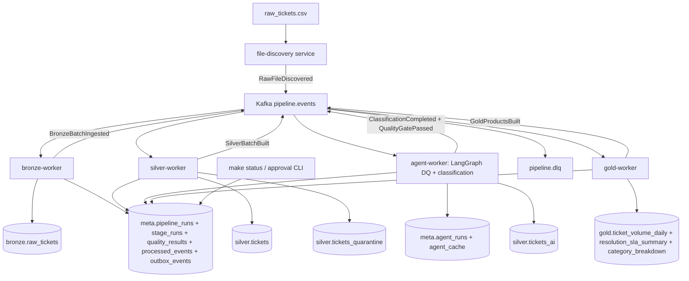

# Event-Driven Medallion AI Pipeline — Frozen Local Implementation Plan

This plan is frozen as the agreed local implementation architecture. Do not change it unless a new versioned plan is created.

References:

- `medallion_pipeline/README_assignment_v2_AI_Engineer-1 (1).md`
- `medallion_pipeline/MEDALLION_ARCHITECTURE_BEST_PRACTICES.md`
- `medallion_pipeline/raw_tickets.csv`

## Key Architecture Decisions

- **Event-driven, but batch-event driven.** Kafka carries stage/batch events, not rows. Postgres remains the durable source of truth for bronze/silver/gold/meta data.
- **Local stack: Docker Compose with Postgres 16 + Kafka/KRaft + one shared Python image.** Run separate worker containers from the same codebase: `file-discovery`, `bronze-worker`, `silver-worker`, `agent-worker`, `gold-worker`, plus a CLI/status command.
- **Topics stay coarse.** Use `pipeline.events`, `pipeline.retry`, and `pipeline.dlq` for the assignment. Topic-per-stage is documented as a scale-out option, not necessary locally.
- **Event contracts are Pydantic JSON, not Schema Registry.** Every event includes `event_id`, `event_type`, `event_version`, `run_id`, `batch_id`, `correlation_id`, `idempotency_key`, `attempt`, `occurred_at`, and `payload`.
- **Delivery model: at-least-once Kafka + idempotent consumers.** Kafka exactly-once does not protect Postgres writes. Each consumer records `meta.processed_events(event_id)` and commits offsets only after the DB transaction succeeds.
- **Outbox: lightweight local version.** For local, each stage writes `meta.stage_events`/`meta.outbox_events` in the same transaction as data changes, then publishes follow-up Kafka events. Production upgrade: Debezium CDC over the outbox.
- **Backend: one shared PostgreSQL database.** Schemas `bronze`, `silver`, `gold`, `meta`. Per-service DBs are overkill here and would weaken medallion lineage/readability for a take-home.
- **Bronze identity = `(source_file, raw_line_no)`, not content hash.** This preserves every physical line. `content_hash` is a change-fingerprint only.
- **Dedup happens in Silver.** Use `ticket_id` when it matches `^TKT-\d+$`; otherwise use a fingerprint from cleaned date/building/submitter/description. Route dedup losers to `silver.tickets_dups`.
- **Classification is per-distinct-value + cached, never per-row.** Dictionary/regex pre-pass resolves known categories; LLM only resolves unknown distinct values and proposes canonical mappings applied via SQL join.
- **LLM = OpenAI `gpt-4o-mini`, temperature 0, Structured Outputs + Pydantic.** No API key should degrade to dictionary-only classification, unknowns flagged, pipeline still runs.
- **LangGraph lives only inside `agent-worker`.** Kafka is the pipeline coordinator; LangGraph is for agent loops where iteration helps.
- **HITL is first-class but lean.** High-risk agent proposals emit `AgentProposalCreated`; CLI writes approve/reject state and can emit approval/rejection events.
- **Observability is metadata-first locally.** Store run, stage, quality, event, outbox, DLQ, and agent telemetry in Postgres meta tables, then expose it through structured logs and `make status`.
- **SLA is split into business SLA and pipeline SLA.** Gold reports ticket-resolution SLA from clean Silver data; meta tables track whether each pipeline batch finishes within expected local stage durations.

## Pipeline Flow



## Event Contracts and Topics

Topics:

- `pipeline.events`: normal stage events and commands.
- `pipeline.retry`: optional retry topic for failed transient events.
- `pipeline.dlq`: poison events with original payload and error metadata.

Minimum event types:

- `RawFileDiscovered`
- `BronzeBatchIngested`
- `SilverBatchBuilt`
- `AgentProposalCreated`
- `AgentProposalApproved`
- `AgentProposalRejected`
- `ClassificationCompleted`
- `QualityGatePassed`
- `QualityGateFailed`
- `GoldProductsBuilt`
- `PipelineRunCompleted`
- `StageFailed`

Event shape:

```json
{
  "event_id": "uuid",
  "event_type": "BronzeBatchIngested",
  "event_version": "v1",
  "run_id": "uuid",
  "batch_id": "raw_tickets_20260620",
  "correlation_id": "uuid",
  "idempotency_key": "bronze:raw_tickets_20260620:v1",
  "attempt": 1,
  "occurred_at": "2026-06-20T00:00:00Z",
  "payload": {
    "source_file": "raw_tickets.csv",
    "row_count": 10280,
    "bronze_table": "bronze.raw_tickets"
  }
}
```

## Data Model

- `bronze.raw_tickets`: all source columns as TEXT + `source_file`, `raw_line_no`, `ingested_at`, `batch_id`, `content_hash`, `raw_payload JSONB`, `extra_fields JSONB`. Unique on `(source_file, raw_line_no)`.
- `silver.tickets`: typed/cleaned/normalized records, raw fields preserved where useful, parsed timestamps, ambiguity flags, validation flags, business key, dedup status, lineage.
- `silver.tickets_quarantine`: rejected rows + reason code.
- `silver.tickets_dups`: dedup losers.
- `silver.tickets_ai`: AI enrichments keyed by ticket/text hash; never overwrites source.
- `gold.ticket_volume_daily`
- `gold.resolution_sla_summary`
- `gold.category_breakdown`
- `meta.pipeline_runs`, `meta.stage_runs`
- `meta.stage_events`, `meta.outbox_events`
- `meta.processed_events`
- `meta.agent_runs`, `meta.agent_cache`
- `meta.quality_results`, `meta.lineage`
- `meta.source_schemas` for schema drift detection.

## Agents

### Data Quality Agent

Covers schema inference/evolution and data-quality rule proposal.

Inputs:

- Current batch ID.
- Bronze profile stats.
- Current source schema and previous schema.
- Quarantine counts.
- Prior accepted/rejected rules.

Outputs:

- Proposed Silver schema/rule changes.
- Rationale for each rule.
- Risk level.
- Structured JSON validated with Pydantic.

Execution rule: agent proposes, deterministic code validates and applies after approval.

### Semantic Classification Agent

Covers category normalization and text enrichment.

Approach:

- Deterministic dictionary/regex pre-pass.
- LLM only for unknown distinct dirty values.
- Cache by `hash(model + prompt_version + normalized_text)`.
- Confidence threshold.
- Below-threshold values become `unclassified`.
- Output lands in `silver.tickets_ai`.

### Optional Gold Design Suggester

Design-time helper that proposes 2-3 Gold products and a dimensional model sketch. Final Gold tables are deterministic and documented.

## Schema Drift Handling

Bronze accepts drift without breaking:

- Known columns stay as TEXT columns.
- Full row is stored in `raw_payload JSONB`.
- Unexpected columns go into `extra_fields JSONB`.
- Current header is compared with `meta.source_schemas`.
- Drift emits `SchemaDriftDetected` or logs to quality results.
- Silver ignores unknown columns until approved mapping/rules exist.

Drift policy:

- New nullable column: store in `extra_fields`; agent proposes Silver mapping.
- Missing expected column: Silver fills NULL and flags `missing_column`.
- Renamed column: agent may suggest mapping; human approval required.
- Type change: Bronze accepts text; Silver flags parse failures.
- Column order change: use header-based parsing.
- Malformed row/column shift: quarantine with reason code.

## Critical Correctness Rules

- Dates: declare US `MM/DD` policy because AM/PM and epoch values are present; flag ambiguous dates.
- Do not feed guessed dates into SLA metrics.
- Validate `resolved_at < created_at` after disambiguation.
- Cost: strip `$`; map `-1`, negatives, `N/A`, `TBD` to NULL + flag.
- SLA: exclude `0` and `999` from Gold metrics.
- Quarantine structurally untrustworthy rows; flag field-level anomalies in place.
- Reconciliation gate: `bronze = clean + quarantine + dedup_removed`.
- AI never overwrites source fields.
- PII columns are tagged and redacted before prompts.

## Local Observability and SLA

The local build should demonstrate the production shape without adding a full monitoring stack. Postgres remains the control plane for observability:

- `meta.pipeline_runs`: one row per end-to-end run with batch ID, source file, status, timestamps, and final counts.
- `meta.stage_runs`: one row per worker stage with start/end timestamps, status, duration, input/output counts, and error text.
- `meta.quality_results`: reconciliation checks, parse failures, quarantine counts, dedup counts, SLA exclusions, and Gold-readiness checks.
- `meta.processed_events`, `meta.outbox_events`, and `pipeline.dlq`: duplicate-event protection, DB-to-Kafka recovery, retry history, and poison-event evidence.
- `meta.agent_runs` and `meta.agent_cache`: model, prompt version, input hash, confidence, token/cost metadata, cache hits, and parse failures.

`make status` should summarize the latest run: stage status, row counts, clean/quarantine/dedup reconciliation, DLQ count, failed quality checks, agent cost/cache stats, and whether Gold products are safe to read.

Business SLA is measured in Gold from clean ticket data:

- Use `sla_hours`, `created_at`, and `resolved_at` only after Silver parsing and validation.
- Exclude sentinel SLA values such as `0` and `999`, missing/invalid dates, ambiguous dates, and `resolved_at < created_at`.
- Report SLA met rate, breach count, median/p95 resolution hours, and breakdowns by priority, category, and assigned team.

Pipeline SLA is operational and local:

- Track stage duration and total batch duration in `meta.stage_runs` and `meta.pipeline_runs`.
- Mark a stage as late when it exceeds a simple documented threshold for this dataset.
- Surface late/failed stages in `make status`; production alerting belongs in the at-scale plan.

## Event-Driven Failure Handling

- Duplicate event: skip if `event_id` exists in `meta.processed_events`.
- Consumer crash before offset commit: Kafka redelivers; DB constraints make retry safe.
- DB commit succeeds but publish fails: `meta.outbox_events` allows republish.
- Poison event: retry 2-3 times, then publish to `pipeline.dlq`.
- OpenAI timeout/rate limit: retry with backoff, then mark agent run failed and fall back if safe.
- Invalid agent JSON: reject proposal, store failure, do not mutate Silver/Gold.
- Quality gate failure: publish `QualityGateFailed`; do not build Gold.

## File Layout

```text
medallion_pipeline/
  docker-compose.yml  Makefile  requirements.txt  .env.example  README.md
  sql/schema.sql
  src/
    config.py  db.py  events.py  kafka_io.py  workers.py
    bronze.py  silver.py  gold.py  quality.py  llm.py
    agents/dq_agent.py  agents/classify_agent.py  agents/gold_suggester.py
    services/file_discovery.py  services/bronze_worker.py
    services/silver_worker.py  services/agent_worker.py
    services/gold_worker.py  cli.py
    eval/labeled_categories.csv  eval/run_eval.py
```

## Implementation Timebox

- 0:00-0:50: Docker Compose, Makefile, schema, config, DB, event and Kafka helpers.
- 0:50-1:30: Event spine, processed events, stage events, outbox events, DLQ helper, CLI.
- 1:30-2:15: Bronze worker with file discovery, COPY ingest, profiling.
- 2:15-3:30: Silver worker with set-based SQL, validation, dedup, quarantine, reconciliation.
- 3:30-4:45: Agent worker, LLM cache, DQ loop, classification.
- 4:45-5:20: Gold worker and three Gold products.
- 5:20-6:00: Eval harness, README, architecture diagram, failure handling, double-run check.

## Acceptance Checklist

- `docker compose up -d` plus one command runs end-to-end through Kafka events.
- Pipeline runs without OpenAI key in degraded dictionary-only mode.
- Events have stable IDs, versions, correlation IDs, idempotency keys, attempts, and DLQ metadata.
- Consumers commit Kafka offsets only after successful DB transactions.
- Duplicate event delivery does not duplicate data or Gold metrics.
- Outbox rows allow republish after DB-success/Kafka-failure crash.
- Re-run twice produces identical Silver/Gold counts and no extra Bronze rows.
- Re-run hits the LLM cache; no repeat spend for unchanged inputs.
- Batch reconciliation passes: `bronze = clean + quarantine + dedup_removed`.
- Every excluded row has a reason code.
- Gold has no negative resolution time, invalid cost, or sentinel SLA values.
- `make status` shows latest run health, stage durations, quality failures, DLQ count, and Gold readiness.
- Gold SLA metrics exclude invalid/sentinel SLA inputs and report breach rates by useful dimensions.
- AI columns include confidence, model, prompt version, token/cost metadata.
- README includes diagram, event contracts, observability/SLA approach, agent assessment, failure handling, and 100x scale section.
